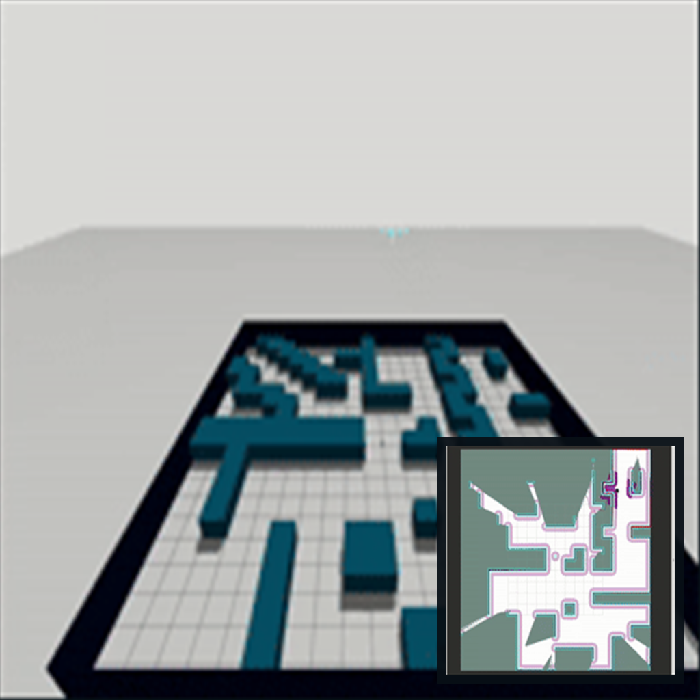
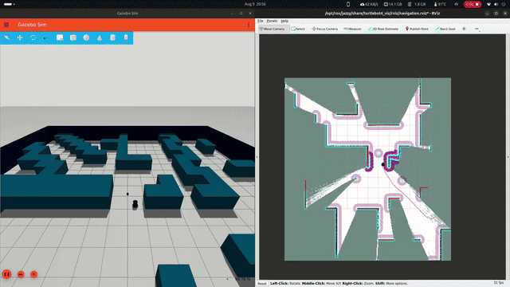
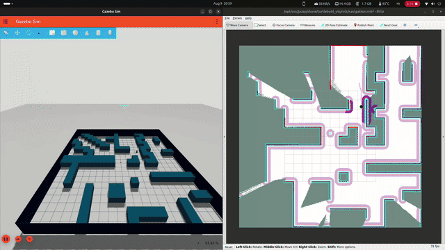
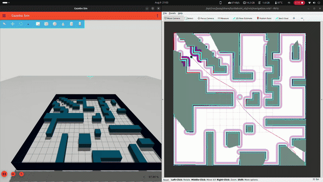
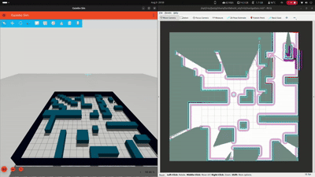
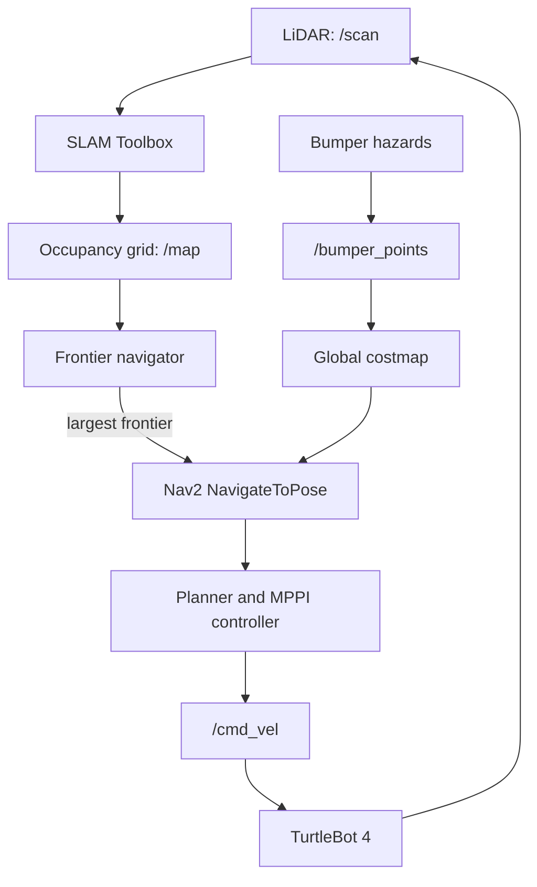

# Autonomous Frontier Navigation for TurtleBot 4


An autonomous exploration stack for a simulated TurtleBot 4. The robot builds a map with SLAM, finds the boundary between mapped free space and unexplored space, and sends that boundary to Nav2 as its next destination. It continues until the map no longer contains a frontier target.



## See it in action

| Mapping and exploration | Autonomous navigation |
| --- | --- |
|  |  |
| Obstacle-aware planning | Continued coverage |
|  |  |

## How autonomous navigation works



1. **Map the environment.** SLAM publishes an `OccupancyGrid` on `/map`. Each cell is classified as free (`0`), occupied, or unknown (`-1`).
2. **Detect exploration frontiers.** `FrontierNavigator` creates masks for free and unknown cells. It dilates free space by one `3 × 3` cell kernel and intersects it with unknown space. The result is the one-cell-wide boundary where the robot can discover more map.
3. **Choose a target.** Connected-component analysis groups frontier cells. The navigator selects the largest group and uses its centroid as the goal. It converts the centroid from map pixels to metres using the map origin and resolution.
4. **Navigate safely.** The target is submitted to Nav2’s `navigate_to_pose` action in the `map` frame. NavFn generates the global route; the MPPI controller follows it while the costmaps use `/scan` data for obstacle avoidance.
5. **Prevent duplicate goals.** While a Nav2 goal is pending, an `exploring` lock ignores new map updates. When Nav2 succeeds, cancels, or aborts the goal, the lock is released and the latest map can produce the next frontier.
6. **Record bumper contacts.** `BumperToPointcloud` converts TurtleBot 4 bump events into `/bumper_points` in `base_link`. The global obstacle layer marks these points without clearing them, preserving collision evidence that LiDAR may not observe.

### Navigation configuration

The custom Nav2 configuration in [`nav2_params.yaml`](src/e2e_collector/config/nav2_params.yaml) is tuned for the TurtleBot 4 simulation:

- **Global planner:** NavFn, with traversal through unknown space allowed while exploring.
- **Local controller:** MPPI in differential-drive mode, generating velocity commands from a sampled trajectory batch.
- **Costmaps:** a 3 m rolling local map and a global map with LiDAR, bumper points, and 0.45 m inflation.
- **Collision monitor:** uses the robot footprint and LiDAR to slow/approach safely when a collision is predicted.

## Architecture

| Component | Responsibility |
| --- | --- |
| `turtlebot4_gz_bringup` | Starts the TurtleBot 4 maze simulation, SLAM, RViz, and Nav2. |
| `frontier_navigator` | Finds the next frontier and dispatches Nav2 goals. |
| `bumper_mapper` | Turns hazard detections into obstacle point clouds. |
| Nav2 | Plans, controls, monitors collisions, and publishes `/cmd_vel`. |
| `e2e_data_collector` | Captures the latest image, LiDAR, odometry, goal, and command-label samples for later learning workflows. |

## Quick start

### Prerequisites

- Docker with Docker Compose
- NVIDIA Container Toolkit and an NVIDIA GPU for the compose configuration
- Linux desktop session with X11 available (RViz and Gazebo are displayed through X11)

### Build and launch

```bash
docker compose build
docker compose run --rm ros-dev bash
```

Inside the container, build the ROS workspace and launch the stack:

```bash
cd /ros2_ws
colcon build --symlink-install
source install/setup.bash
ros2 launch e2e_collector collector.launch.py
```

The launch file starts the TurtleBot 4 **maze** world with SLAM and Nav2 enabled, opens RViz, starts the frontier navigator, and starts the data collector. Exploration begins when `/map` is available; no manually placed navigation goal is required.

### Observe the system

Useful ROS 2 commands from a second shell in the container:

```bash
ros2 topic echo /map --once
ros2 topic echo /bumper_points
ros2 action list | grep navigate_to_pose
ros2 node list
```

In RViz, add the map, global/local costmaps, laser scan, and Nav2 path displays to follow the robot’s decisions.

## Data collection

`e2e_data_collector` subscribes to the RealSense image stream, LiDAR, odometry, goal pose, and `/cmd_vel`. Whenever a velocity command arrives and an image is available, it writes:

- `img_<timestamp>.jpg` — camera frame
- `data_<timestamp>.json` — timestamp, command label (`linear.x`, `angular.z`), odometry, active goal, and LiDAR ranges

The collector writes inside the container at `/ros2_ws/src/collected_data`.

## Repository layout

```text
.
├── compose.yaml                         # GPU/X11 development container
├── Dockerfile                           # ROS 2 Jazzy + TurtleBot 4 dependencies
├── media/                               # README screenshots and demos
└── src/e2e_collector/
    ├── config/nav2_params.yaml          # Nav2 controller, planner, and costmap settings
    ├── launch/collector.launch.py       # Simulation and node orchestration
    └── e2e_collector/
        ├── frontier_navigation.py       # Frontier detection and goal dispatch
        └── collector_node.py             # Sensor/action data logging
```

## Limitations

- The current selector optimizes for the largest frontier, not travel cost, information gain, or battery state.
- Goals are sent at a frontier centroid; a production system should validate the centroid against inflated obstacles and choose a reachable nearby pose.
- Bumper contacts are retained in the global costmap. A decay or recovery policy may be useful for longer missions.

## Roadmap

- [ ] Reduce costmap inflation where it blocks otherwise safe routes.
- [ ] Spawn the docking station as a static obstacle to avoid localization noise from dock collisions.
- [ ] Add a hybrid frontier-search strategy to reduce redundant map scans.
- [ ] Rename the collector node to `AutoSLAM` and complete its collection workflow.
- [ ] Add a mapping-completion check and a mapping action server to manage the task.
- [ ] Automate the switch from mapping mode to data-collection mode through the launch workflow.

## License

No license has been declared yet. Add a license file before distributing or accepting external contributions.
